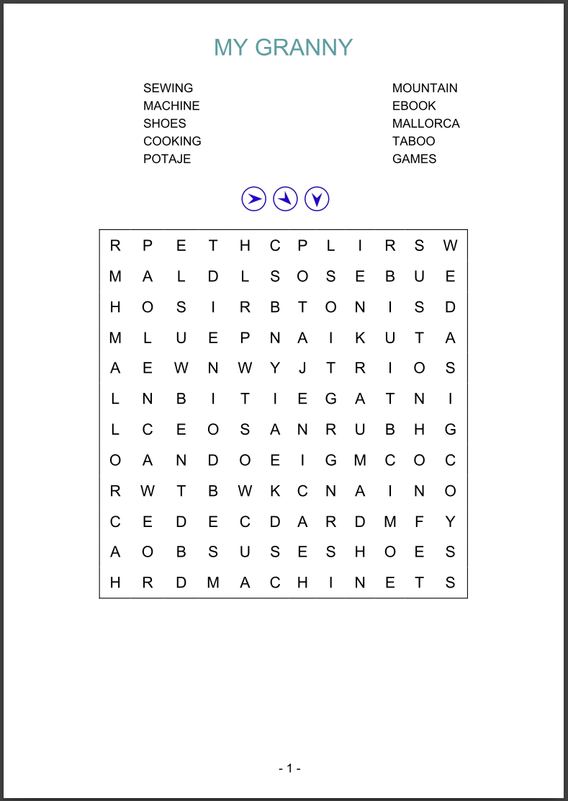
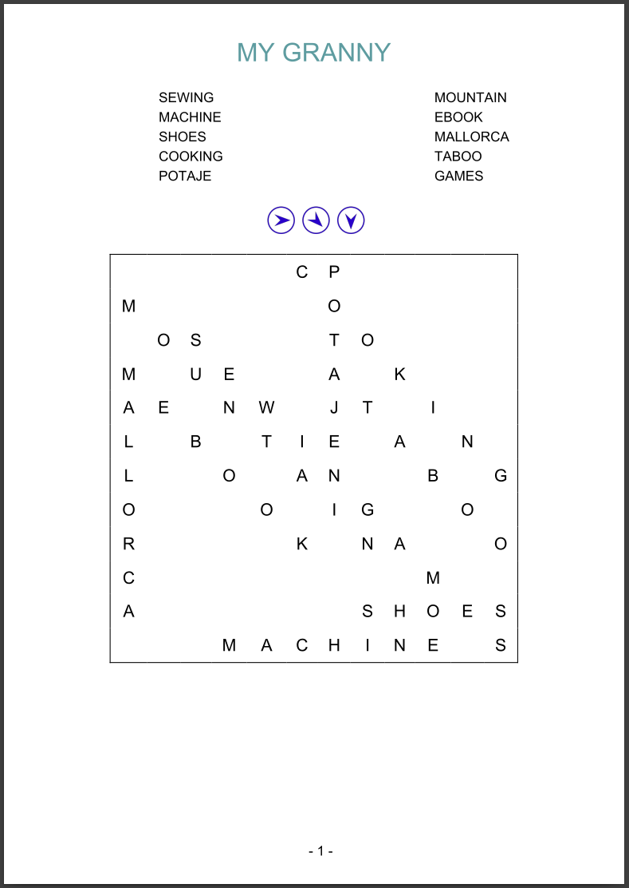

# ALPHASOUP

## Introduction

This project generates a printable (pdf) set of pages with alphabet soups.
Each alphabet soup can be configurable (`config/config.yml`) with many options (the words, dimensions, and much more).

This was conceived as a present to my grandmother, to whom I dedicate this project. She loves alphabet soups and I wanted to create a personal one by myself.

This project relies on Docker.

From the given configuration (`config/config.yml`) it outputs (`output/`) all the alphabet soups in pdf file/s.

## Docker

Some useful docker scripts:

```bash
docker image build -t alphasoup .
docker container run -it --name alphasoup_000 -v $(pwd)/config:/alphasoup/config -v $(pwd)/templates:/alphasoup/templates -v $(pwd)/output:/alphasoup/output alphasoup python3 -m main
docker container rm alphasoup_000
```

## Config

Example of configuration (`config/config.yml`):

```yaml
global:

  log:
    level: INFO  # DEBUG, INFO, WARNING, ERROR

  ways:
    ways_easy: &WAYS_EASY [ E, S ]
    ways_normal: &WAYS_NORMAL [ E, SE, S ]
    ways_ALL: &WAYS_ALL [ E, SE, S, SW, W, NW, N, NE ]

  lang: ...
  
  output: ...

defaults:

  alphasoup: &ALPHASOUP
    ways: *WAYS_NORMAL
    rows: 12
    cols: 12
    words: []
    letters: *LETTERS_EN
    letters_weights_map: *LETTERS_WEIGHTS_EN

  html: &HTML ...

  pdfa5: &PDFA5 ...

pages:

  - alphasoup:
      <<: *ALPHASOUP
      ways: *WAYS_NORMAL
      rows: 12
      cols: 12
      words:
        - SEWING
        - MACHINE
        - SHOES
        - COOKING
        - POTAJE
        - MOUNTAIN
        - EBOOK
        - MALLORCA
        - TABOO
        - GAMES
    html:
      <<: *HTML
      title: MY GRANNY
    pdfa5: *PDFA5
```

## Output

Example of output (`output/`) with the above configuration:

### Output Sample:



### Output Solution Sample:



According to the configuration (`config/config.yml`) we can decide how we want the output pdf files:

```yaml
global:
  ...
  output:
    # dirs/paths
    ...
    # settings
    solution: True  # output also the solution alphasoup (an alphasoup just with the letters of the words)
    html: False  # output the html (and css) files, used to build the pdf documents
    pdfa5: False  # output many pdf DIN-A5 documents with 1-page each
    pdfa5_merger: True  # output one single pdf DIN-A5 document with many pages
    pdfa4: False  # output many pdf DIN-A4 documents with 2 DIN-A5 pages each
    pdfa4_merger: False  # output one single pdf DIN-A4 document with many pages, with DIN-A5 pages each
```

## Summary of Capabilities
- Docker, Python 3.9
- Flow: Config (yaml) -> Alphasoup (python object) -> HTML+CSS -> PDF -> your hands (if you print it)
- Alphabet Soup algorithm:
  - Words are inserted randomly
  - Background is filled randomly, with the letters and weights provided by config
  - Word crosses are allowed
- Alphabet Soup configuration:
  - Number of rows and columns (up to 24)
  - Ways/Directions allowed: `[ E, SE, S, SW, W, NW, N, NE ]`
  - Words of the alphabet soup (up to 32)
  - Letters allowed (for different languages)
  - Letter weights (configured for English and Spanish letter frequencies)
  - HTML and PDF configuration
- Output configuration:
  - We can configure to output the solution (alphabet soup filled only with letter from the words)
  - We can configure to output PDFs as one PDF per page, many pages in one PDF, DIN-A5, DIN-A4 with two DIN-A5

## Summary of Things to Improve
- Alphabet Soup algorithm:
  - Words are inserted from a random position and a random way/direction one by one. If a word crosses another one it is validated, if the cross is valid then it is inserted, otherwise it keeps trying in another position. As crosses are not enforced (just random) and there is no guarantee or control of a way/direction uniform distribution of words, **the algorithm tends to place a lot of words in parallel**, specially in high density alphabet soups.
  - Insertions of words are attempted randomly. This makes that, **in some cases, the alphabet soup find that it is *impossible* to fill the alphabet soup, while it is actually possible**. This happens specially in high density alphabet soups and specially when last words are too long. **A partial solution has been made**: to attempt the alphabet soup and, if it fails, try again with the words in inverse order. This makes it really unlikely to fail, but it's still not perfect.